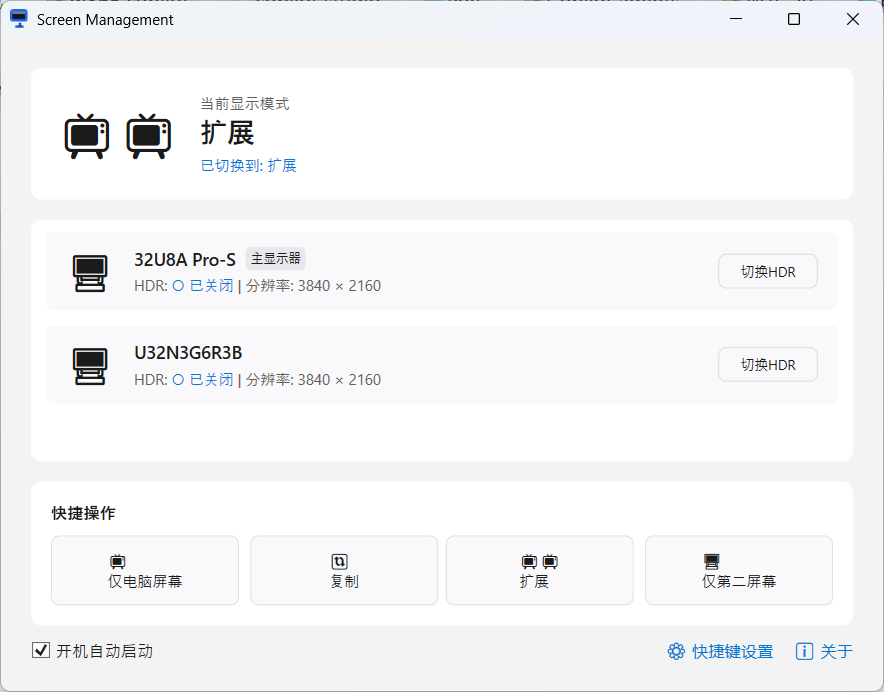
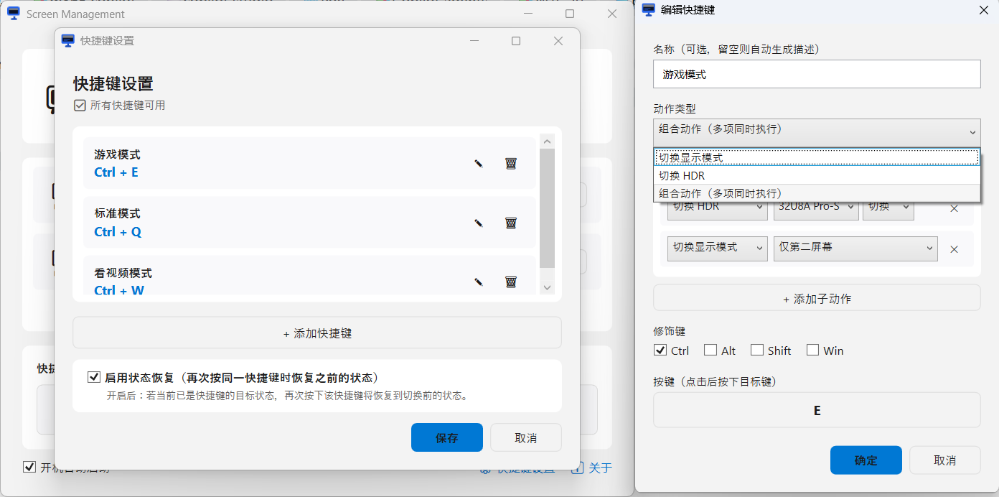

# Screen Management 🖥

[中文](./README.md) | [English](./README.en.md)

一个轻量级 Windows 屏幕管理工具，通过全局快捷键和系统托盘快速切换显示模式和 HDR 状态。

## 📸 界面截图

### 主界面



### 快捷键配置



## ✨ 功能

- 🖥 **一键切换显示模式**: 仅电脑屏幕 / 复制 / 扩展 / 仅第二屏幕
- 🎨 **HDR 管理**: 支持 HDR 的显示器可一键开关 HDR
- ⌨ **全局快捷键**: 自定义快捷键组合，随时切换
- 🔗 **组合动作**: 一次快捷键执行多个操作（如切换扩展模式 + 开启 HDR）
- 📌 **系统托盘**: 托盘图标实时反映当前状态，右键菜单快速操作
- 🚀 **开机自启**: 支持静默启动到系统托盘

## 📋 系统要求

- Windows 10 2004+ / Windows 11
- .NET 10 Desktop Runtime（框架依赖版本）
- x64 架构

## 📥 安装

从 [Releases](https://github.com/qiuhaotc/ScreenManagement/releases) 页面下载最新版本：

| 文件 | 说明 |
|------|------|
| `ScreenManagement-vX.Y.Z-win-x64-full.zip` | 自包含版，无需安装 .NET Runtime，体积较大 |
| `ScreenManagement-vX.Y.Z-win-x64.zip` | 框架依赖版，体积小，需安装 [.NET 10 Desktop Runtime](https://dotnet.microsoft.com/download/dotnet/10.0) |

## ⌨ 默认快捷键

| 快捷键 | 动作 |
|--------|------|
| Ctrl+Shift+F1 | 切换到"仅电脑屏幕" |
| Ctrl+Shift+F2 | 切换到"扩展模式" |
| Ctrl+Shift+F3 | 切换到"仅第二屏幕" |

快捷键可在设置界面自定义。

## 🛠 开发

### 环境要求

- .NET 10 SDK
- Windows 10/11（开发与运行）
- Visual Studio 2026+ 或 VS Code（安装 C# 扩展）

### 构建

```bash
# 还原依赖
dotnet restore

# 构建
dotnet build

# 运行
dotnet run --project src/ScreenManagement.UI

# 测试
dotnet test src/ScreenManagement.Test/ScreenManagement.Test.csproj

# 发布单文件
dotnet publish src/ScreenManagement.UI/ScreenManagement.UI.csproj --configuration Release --runtime win-x64 --self-contained true -p:PublishSingleFile=true -p:EnableCompressionInSingleFile=true
```

### CI/CD

- Push 到 `main` 或向 `main` 提交 PR 时，自动执行构建和单元测试
- Push `v*` 标签（如 `v1.0`、`v0.0.1`）时，自动测试、发布并创建 GitHub Release

### 项目结构

```
ScreenManagement/
├── src/
│   ├── ScreenManagement.Business/   # 业务逻辑层
│   ├── ScreenManagement.UI/         # WPF 界面层
│   └── ScreenManagement.Test/       # 测试层
├── .github/workflows/               # CI/CD
├── docs/                            # 设计文档
└── README.md
```

## 📄 许可证

MIT License
