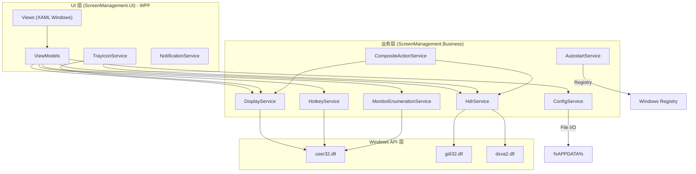
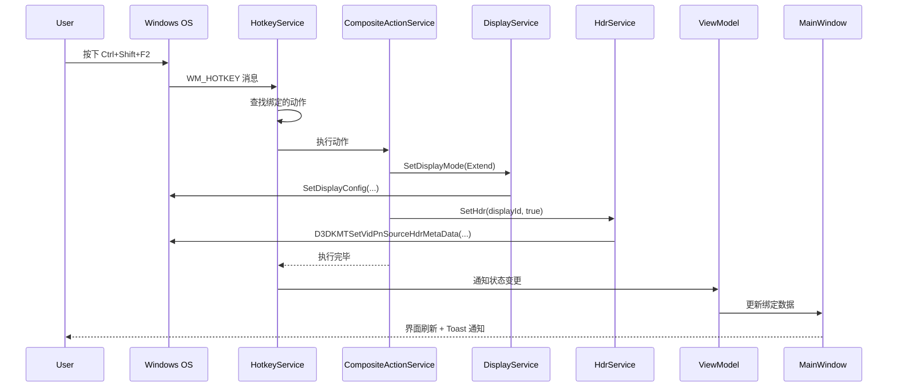

# Screen Management — 实现方案

> **版本**: v1.0  
> **最后更新**: 2026-06-07  
> **对应需求**: [需求规格说明书](./需求.md)

---

## 目录

1. [架构设计](#1-架构设计)
2. [核心接口设计](#2-核心接口设计)
3. [关键实现细节](#3-关键实现细节)
4. [DI 与启动流程](#4-di-与启动流程)
5. [MVVM 设计](#5-mvvm-设计)
6. [开发阶段与里程碑](#6-开发阶段与里程碑)
7. [测试策略](#7-测试策略)
8. [CI/CD 配置](#8-cicd-配置)
9. [打包与发布](#9-打包与发布)

> **UI 框架选型变更**: 原方案使用 .NET MAUI，现已改为 **WPF (.NET 10)**。原因：WPF 对 Windows 原生托盘、全局热键、Window 消息处理有更成熟的支持，更适合纯 Windows 桌面工具。

---

## 1. 架构设计

### 1.1 分层架构



### 1.2 设计原则

| 原则 | 实践 |
|------|------|
| **IoC / DI** | 所有服务通过接口注入，`App.xaml.cs` 中使用 `Microsoft.Extensions.Hosting` 统一注册 |
| **单一职责** | 每个 Service 仅负责一项职责（显示/HDR/快捷键/配置...） |
| **接口隔离** | 每个接口仅包含必要方法，不强制实现无关功能 |
| **依赖倒置** | 高层模块（ViewModel）依赖接口而非具体实现 |
| **MVVM** | View 仅负责渲染，ViewModel 持有状态和命令 |

### 1.3 数据流



---

## 2. 核心接口设计

### 2.1 IDisplayService

```csharp
public interface IDisplayService
{
    /// <summary>获取当前显示模式</summary>
    DisplayMode GetCurrentMode();

    /// <summary>切换到指定显示模式</summary>
    /// <returns>是否成功</returns>
    Task<bool> SetDisplayModeAsync(DisplayMode mode);

    /// <summary>显示模式变更事件</summary>
    event EventHandler<DisplayMode> DisplayModeChanged;
}
```

### 2.2 IHdrService

```csharp
public interface IHdrService
{
    /// <summary>获取指定显示器的 HDR 状态</summary>
    Task<bool> IsHdrEnabledAsync(string displayId);

    /// <summary>设置 HDR 状态</summary>
    Task<bool> SetHdrAsync(string displayId, bool enable);

    /// <summary>切换 HDR 状态</summary>
    Task<bool> ToggleHdrAsync(string displayId);

    /// <summary>检测显示器是否支持 HDR</summary>
    bool SupportsHdr(string displayId);
}
```

### 2.3 IMonitorEnumerationService

```csharp
public interface IMonitorEnumerationService
{
    /// <summary>获取所有连接的显示器</summary>
    Task<IReadOnlyList<DisplayInfo>> GetDisplaysAsync();

    /// <summary>刷新显示器列表（热插拔时调用）</summary>
    Task RefreshAsync();

    /// <summary>显示器变更事件</summary>
    event EventHandler<IReadOnlyList<DisplayInfo>> DisplaysChanged;
}
```

### 2.4 IHotkeyService

```csharp
public interface IHotkeyService
{
    /// <summary>注册所有启用的快捷键</summary>
    Task RegisterAllAsync(IEnumerable<HotkeyBinding> bindings);

    /// <summary>注册单个快捷键</summary>
    /// <returns>null=成功，否则返回冲突的软件名</returns>
    string? RegisterHotkey(HotkeyBinding binding);

    /// <summary>注销所有快捷键</summary>
    void UnregisterAll();

    /// <summary>检测快捷键是否可用（不实际注册）</summary>
    bool IsHotkeyAvailable(ModifierKeys modifiers, uint key);

    /// <summary>快捷键触发事件</summary>
    event EventHandler<HotkeyTriggeredEventArgs> HotkeyTriggered;
}

public class HotkeyTriggeredEventArgs : EventArgs
{
    public HotkeyBinding Binding { get; init; }
}
```

### 2.5 IConfigService

```csharp
public interface IConfigService
{
    Task<AppConfig> LoadAsync();
    Task SaveAsync(AppConfig config);
    string ConfigFilePath { get; }
}
```

### 2.6 IAutostartService

```csharp
public interface IAutostartService
{
    bool IsAutostartEnabled();
    void SetAutostart(bool enable);
}
```

### 2.7 ICompositeActionService

```csharp
public interface ICompositeActionService
{
    /// <summary>执行一个快捷键动作（支持组合动作递归）</summary>
    Task ExecuteAsync(HotkeyBinding binding);
}
```

---

## 3. 关键实现细节

### 3.1 显示模式切换

使用 CCD (Connecting and Configuring Displays) API：

```csharp
public async Task<bool> SetDisplayModeAsync(DisplayMode mode)
{
    return await Task.Run(() =>
    {
        // 1. 获取当前显示配置路径和模式信息
        var error = NativeMethods.GetDisplayConfigBufferSizes(
            QueryDisplayFlags.DatabaseCurrent,
            out uint pathCount, out uint modeCount);

        if (error != 0) return false;

        var paths = new DISPLAYCONFIG_PATH_INFO[pathCount];
        var modes = new DISPLAYCONFIG_MODE_INFO[modeCount];

        error = NativeMethods.QueryDisplayConfig(
            QueryDisplayFlags.DatabaseCurrent,
            ref pathCount, paths,
            ref modeCount, modes,
            IntPtr.Zero);

        if (error != 0) return false;

        // 2. 设置目标拓扑
        uint topologyId = mode switch
        {
            DisplayMode.Internal => DISPLAYCONFIG_TOPOLOGY_INTERNAL,
            DisplayMode.Clone   => DISPLAYCONFIG_TOPOLOGY_CLONE,
            DisplayMode.Extend  => DISPLAYCONFIG_TOPOLOGY_EXTEND,
            DisplayMode.External => DISPLAYCONFIG_TOPOLOGY_EXTERNAL,
            _ => DISPLAYCONFIG_TOPOLOGY_EXTEND
        };

        // 3. 应用新配置
        error = NativeMethods.SetDisplayConfig(
            pathCount, paths,
            modeCount, modes,
            SdcFlags.Apply | SdcFlags.UseDatabaseCurrent | topologyId);

        if (error != 0)
        {
            _logger.LogError("SetDisplayConfig failed: {Error}", error);
            return false;
        }

        OnDisplayModeChanged(mode);
        return true;
    });
}
```

### 3.2 HDR 切换

> ⚠ **关键风险点**: `D3DKMTSetVidPnSourceHdrMetaData` 可能需要特定权限或在用户态下行为受限。必须在开发初期验证 API 可用性。

```csharp
public async Task<bool> SetHdrAsync(string displayId, bool enable)
{
    return await Task.Run(() =>
    {
        // 通过 DisplayConfigGetDeviceInfo 获取 DISPLAYCONFIG_DEVICE_INFO_HEADER
        // 设置 DISPLAYCONFIG_SET_ADVANCED_COLOR_STATE
        // 使用 DISPLAYCONFIG_DEVICE_INFO_TYPE.SET_ADVANCED_COLOR_STATE

        var request = new DISPLAYCONFIG_SET_ADVANCED_COLOR_STATE
        {
            header = new DISPLAYCONFIG_DEVICE_INFO_HEADER
            {
                type = DISPLAYCONFIG_DEVICE_INFO_TYPE.SET_ADVANCED_COLOR_STATE,
                size = (uint)Marshal.SizeOf<DISPLAYCONFIG_SET_ADVANCED_COLOR_STATE>(),
                adapterId = GetAdapterId(displayId),
                id = GetSourceId(displayId)
            },
            state = enable
                ? DISPLAYCONFIG_ADVANCED_COLOR_STATE.ENABLED
                : DISPLAYCONFIG_ADVANCED_COLOR_STATE.DISABLED
        };

        var error = NativeMethods.DisplayConfigSetDeviceInfo(
            ref request.header);

        if (error != 0)
        {
            _logger.LogWarning(
                "DisplayConfigSetDeviceInfo failed ({Error}), trying GDI fallback", error);
            return SetHdrViaGdiFallback(displayId, enable);
        }

        return true;
    });
}
```

**备选方案** — 如果 CCD API 对 HDR 支持不足，采用注册表方案：

```
路径: HKLM\SYSTEM\CurrentControlSet\Control\GraphicsDrivers\MonitorDataStore\{MonitorId}\
键值: AdvancedColorEnabled (DWORD: 1=启用, 0=禁用)
```

> 注意：修改注册表后可能需要通过 `ChangeDisplaySettings` 或重启显卡驱动生效。

### 3.3 全局快捷键注册

```csharp
public class HotkeyService : IHotkeyService, IDisposable
{
    private const int WM_HOTKEY = 0x0312;
    private readonly Dictionary<int, HotkeyBinding> _registeredHotkeys = new();
    private int _nextId = 1;
    private IntPtr _hwnd;

    public void Initialize(IntPtr hwnd)
    {
        _hwnd = hwnd;
        // 通过 WPF WindowInteropHelper 获取窗口句柄，拦截 WM_HOTKEY 消息
    }

    public string? RegisterHotkey(HotkeyBinding binding)
    {
        int id = Interlocked.Increment(ref _nextId);
        uint modifiers = (uint)binding.Modifiers;
        bool success = NativeMethods.RegisterHotKey(_hwnd, id, modifiers, binding.Key);

        if (!success)
        {
            int error = Marshal.GetLastWin32Error();
            if (error == 1409) // ERROR_HOTKEY_ALREADY_REGISTERED
            {
                return "快捷键已被其他程序占用";
            }
            return $"注册失败 (错误代码: {error})";
        }

        _registeredHotkeys[id] = binding;
        return null; // 成功
    }

    public IntPtr WndProc(IntPtr hwnd, int msg, IntPtr wParam, IntPtr lParam, ref bool handled)
    {
        if (msg == WM_HOTKEY)
        {
            int id = wParam.ToInt32();
            if (_registeredHotkeys.TryGetValue(id, out var binding))
            {
                HotkeyTriggered?.Invoke(this, new HotkeyTriggeredEventArgs { Binding = binding });
                handled = true;
            }
        }
        return IntPtr.Zero;
    }

    public void UnregisterAll()
    {
        foreach (var kvp in _registeredHotkeys)
        {
            NativeMethods.UnregisterHotKey(_hwnd, kvp.Key);
        }
        _registeredHotkeys.Clear();
    }
}
```

### 3.4 系统托盘实现

使用 `System.Windows.Forms.NotifyIcon` 实现（WPF 项目中启用 WinForms 兼容层）：

```csharp
public class TrayIconService : IDisposable
{
    private NotifyIcon? _notifyIcon;
    private readonly IDisplayService _displayService;
    private readonly IHdrService _hdrService;
    private readonly IMonitorEnumerationService _monitorService;

    public TrayIconService(
        IDisplayService displayService,
        IHdrService hdrService,
        IMonitorEnumerationService monitorService)
    {
        _displayService = displayService;
        _hdrService = hdrService;
        _monitorService = monitorService;
    }

    public void Initialize()
    {
        _notifyIcon = new NotifyIcon
        {
            Icon = GetIconForMode(DisplayMode.Extend),
            Text = "Screen Management",
            Visible = true,
            ContextMenuStrip = BuildContextMenu()
        };

        _notifyIcon.MouseClick += OnTrayClick;
    }

    private ContextMenuStrip BuildContextMenu()
    {
        var menu = new ContextMenuStrip();
        // 动态构建：显示模式子菜单 + HDR 子菜单 + 分隔线 + 打开/关于/退出
        menu.Opening += (s, e) => RefreshMenuState(menu);
        return menu;
    }

    public void UpdateIcon(DisplayMode mode) { /* ... */ }
    public void UpdateTooltip(string text) { /* ... */ }
    public void Dispose() => _notifyIcon?.Dispose();
}
```

### 3.5 单实例检测

```csharp
public static class SingleInstance
{
    private static Mutex? _mutex;
    private const string MutexName = "ScreenManagement_SingleInstance";

    public static bool TryAcquire()
    {
        _mutex = new Mutex(true, MutexName, out bool createdNew);
        return createdNew;
    }

    public static void Release()
    {
        _mutex?.ReleaseMutex();
        _mutex?.Dispose();
    }
}
```

### 3.6 开机自启

```csharp
public class AutostartService : IAutostartService
{
    private const string RunKey = @"Software\Microsoft\Windows\CurrentVersion\Run";
    private const string AppName = "ScreenManagement";

    public bool IsAutostartEnabled()
    {
        using var key = Registry.CurrentUser.OpenSubKey(RunKey);
        return key?.GetValue(AppName) != null;
    }

    public void SetAutostart(bool enable)
    {
        using var key = Registry.CurrentUser.OpenSubKey(RunKey, writable: true);
        if (enable)
        {
            var exePath = Environment.ProcessPath!;
            key?.SetValue(AppName, $"\"{exePath}\" --minimized");
        }
        else
        {
            key?.DeleteValue(AppName, throwOnMissingValue: false);
        }
    }
}
```

### 3.7 显示器热插拔检测

```csharp
// 在窗口 WndProc 中处理
public IntPtr WndProc(IntPtr hwnd, int msg, IntPtr wParam, IntPtr lParam, ref bool handled)
{
    if (msg == WM_DISPLAYCHANGE)
    {
        // 显示器配置变更，刷新列表
        _ = _monitorEnumerationService.RefreshAsync();
        handled = true;
    }

    if (msg == WM_DEVICECHANGE && wParam == DBT_DEVICEARRIVAL || wParam == DBT_DEVICEREMOVECOMPLETE)
    {
        // 设备变更，延迟刷新（等驱动稳定）
        _ = Task.Delay(500).ContinueWith(_ =>
            _monitorEnumerationService.RefreshAsync());
        handled = true;
    }

    return IntPtr.Zero;
}
```

---

## 4. DI 与启动流程

### 4.1 App.xaml.cs — DI 容器配置

WPF 使用 `Microsoft.Extensions.Hosting` 的 `HostApplicationBuilder` 配置 DI 容器：

```csharp
public partial class App : Application
{
    private readonly IHost _host;

    public App()
    {
        // 去掉默认的 StartupUri，在 OnStartup 中手动管理窗口
        var builder = Host.CreateApplicationBuilder();

        // DI 注册 — Business 层
        builder.Services.AddSingleton<IDisplayService, DisplayService>();
        builder.Services.AddSingleton<IHdrService, HdrService>();
        builder.Services.AddSingleton<IHotkeyService, HotkeyService>();
        builder.Services.AddSingleton<IMonitorEnumerationService, MonitorEnumerationService>();
        builder.Services.AddSingleton<IConfigService, ConfigService>();
        builder.Services.AddSingleton<IAutostartService, AutostartService>();
        builder.Services.AddSingleton<ICompositeActionService, CompositeActionService>();

        // DI 注册 — UI 层服务
        builder.Services.AddSingleton<TrayIconService>();
        builder.Services.AddSingleton<NotificationService>();

        // DI 注册 — ViewModels
        builder.Services.AddTransient<MainViewModel>();
        builder.Services.AddTransient<HotkeySettingsViewModel>();
        builder.Services.AddTransient<AboutViewModel>();

        // DI 注册 — Windows
        builder.Services.AddTransient<MainWindow>();
        builder.Services.AddTransient<HotkeySettingsWindow>();
        builder.Services.AddTransient<AboutWindow>();

        // 日志
        builder.Logging.AddDebug();
        builder.Logging.AddFile(
            Path.Combine(
                Environment.GetFolderPath(Environment.SpecialFolder.ApplicationData),
                "ScreenManagement", "logs", "app-{Date}.log"));

        _host = builder.Build();
    }

    public T? GetService<T>() where T : class => _host.Services.GetService<T>();
    public T GetRequiredService<T>() where T : class => _host.Services.GetRequiredService<T>();

    protected override async void OnStartup(StartupEventArgs e)
    {
        base.OnStartup(e);
        await _host.StartAsync();

        // 1. 单实例检查
        if (!SingleInstance.TryAcquire())
        {
            ActivateExistingInstance();
            Shutdown();
            return;
        }

        // 2. 加载配置
        var configService = GetRequiredService<IConfigService>();
        var config = await configService.LoadAsync();

        // 3. 初始化系统托盘
        var trayService = GetRequiredService<TrayIconService>();
        trayService.Initialize();

        // 4. 注册全局快捷键
        var hotkeyService = GetRequiredService<IHotkeyService>();
        // 窗口句柄在 MainWindow 加载后获取

        // 5. 判断启动模式
        bool isAutostart = Environment.GetCommandLineArgs().Contains("--minimized");
        if (!config.StartMinimized && !isAutostart)
        {
            var mainWindow = GetRequiredService<MainWindow>();
            mainWindow.Show();
        }
    }

    protected override async void OnExit(ExitEventArgs e)
    {
        SingleInstance.Release();
        _host.Dispose();
        base.OnExit(e);
    }
}
```

### 4.2 App.xaml

```xml
<Application x:Class="ScreenManagement.UI.App"
             xmlns="http://schemas.microsoft.com/winfx/2006/xaml/presentation"
             xmlns:x="http://schemas.microsoft.com/winfx/2006/xaml">
    <Application.Resources>
        <ResourceDictionary>
            <ResourceDictionary.MergedDictionaries>
                <!-- Fluent 风格样式 -->
                <ResourceDictionary Source="Styles/FluentStyles.xaml"/>
            </ResourceDictionary.MergedDictionaries>
        </ResourceDictionary>
    </Application.Resources>
</Application>
```

> **注意**: WPF `App.xaml` 中不设 `StartupUri`，窗口由 `OnStartup` 代码手动创建，以实现静默启动到托盘。

---

## 5. MVVM 设计

WPF 使用 `CommunityToolkit.Mvvm` 实现 MVVM 模式，通过源生成器减少样板代码。

### 5.1 MainViewModel

```csharp
public partial class MainViewModel : ObservableObject
{
    [ObservableProperty] private DisplayMode _currentMode;
    [ObservableProperty] private ObservableCollection<DisplayInfo> _displays = new();
    [ObservableProperty] private string _statusMessage = string.Empty;
    [ObservableProperty] private bool _isLoading;

    private readonly IDisplayService _displayService;
    private readonly IHdrService _hdrService;
    private readonly IMonitorEnumerationService _monitorService;

    public MainViewModel(
        IDisplayService displayService,
        IHdrService hdrService,
        IMonitorEnumerationService monitorService)
    {
        _displayService = displayService;
        _hdrService = hdrService;
        _monitorService = monitorService;
        _displayService.DisplayModeChanged += OnDisplayModeChanged;
    }

    [RelayCommand]
    private async Task SetDisplayModeAsync(string modeStr)
    {
        if (Enum.TryParse<DisplayMode>(modeStr, out var mode))
        {
            IsLoading = true;
            var success = await _displayService.SetDisplayModeAsync(mode);
            StatusMessage = success ? $"已切换到: {GetModeDisplayName(mode)}" : "切换失败";
            IsLoading = false;
        }
    }

    [RelayCommand]
    private async Task ToggleHdrAsync(DisplayInfo display)
    {
        await _hdrService.ToggleHdrAsync(display.DeviceId);
        await RefreshDisplaysAsync();
    }

    [RelayCommand]
    private async Task RefreshDisplaysAsync()
    {
        var displays = await _monitorService.GetDisplaysAsync();
        Displays = new ObservableCollection<DisplayInfo>(displays);
        CurrentMode = _displayService.GetCurrentMode();
    }

    [RelayCommand]
    private void OpenHotkeySettings()
    {
        var window = new HotkeySettingsWindow();
        window.ShowDialog();
    }

    [RelayCommand]
    private void OpenAbout()
    {
        var window = new AboutWindow();
        window.ShowDialog();
    }

    private void OnDisplayModeChanged(object? sender, DisplayMode mode)
    {
        Application.Current.Dispatcher.Invoke(() =>
        {
            CurrentMode = mode;
            StatusMessage = $"已切换到: {GetModeDisplayName(mode)}";
        });
    }

    private static string GetModeDisplayName(DisplayMode mode) => mode switch
    {
        DisplayMode.Internal => "仅电脑屏幕",
        DisplayMode.Clone => "复制",
        DisplayMode.Extend => "扩展",
        DisplayMode.External => "仅第二屏幕",
        _ => "未知"
    };
}
```

### 5.2 HotkeySettingsViewModel

```csharp
public partial class HotkeySettingsViewModel : ObservableObject
{
    [ObservableProperty]
    private ObservableCollection<HotkeyBindingViewModel> _bindings = new();

    [ObservableProperty] private string _conflictStatus = string.Empty;

    private readonly IHotkeyService _hotkeyService;
    private readonly IConfigService _configService;
    private readonly IMonitorEnumerationService _monitorService;

    public HotkeySettingsViewModel(
        IHotkeyService hotkeyService,
        IConfigService configService,
        IMonitorEnumerationService monitorService)
    {
        _hotkeyService = hotkeyService;
        _configService = configService;
        _monitorService = monitorService;
    }

    [RelayCommand]
    private async Task AddBindingAsync()
    {
        var editVm = new HotkeyEditViewModel(_monitorService);
        var dialog = new HotkeyEditDialog { DataContext = editVm };
        if (dialog.ShowDialog() == true)
        {
            Bindings.Add(HotkeyBindingViewModel.FromModel(editVm.ToModel()));
        }
    }

    [RelayCommand]
    private async Task EditBindingAsync(HotkeyBindingViewModel binding)
    {
        var model = binding.ToModel();
        var editVm = new HotkeyEditViewModel(_monitorService, model);
        var dialog = new HotkeyEditDialog { DataContext = editVm };
        if (dialog.ShowDialog() == true)
        {
            var idx = Bindings.IndexOf(binding);
            Bindings[idx] = HotkeyBindingViewModel.FromModel(editVm.ToModel());
        }
    }

    [RelayCommand]
    private void DeleteBinding(HotkeyBindingViewModel binding) => Bindings.Remove(binding);

    [RelayCommand]
    private async Task SaveAsync()
    {
        var config = await _configService.LoadAsync();
        config.HotkeyBindings = Bindings.Where(b => b.IsEnabled).Select(b => b.ToModel()).ToList();
        await _configService.SaveAsync(config);

        _hotkeyService.UnregisterAll();
        // 需要在 UI 层注入窗口句柄
        await _hotkeyService.RegisterAllAsync(config.HotkeyBindings, IntPtr.Zero);
    }

    [RelayCommand]
    private async Task LoadAsync()
    {
        var config = await _configService.LoadAsync();
        Bindings = new ObservableCollection<HotkeyBindingViewModel>(
            config.HotkeyBindings.Select(HotkeyBindingViewModel.FromModel));
    }
}
```

### 5.3 HotkeyBindingViewModel（包装类）

```csharp
public partial class HotkeyBindingViewModel : ObservableObject
{
    [ObservableProperty] private string _id = string.Empty;
    [ObservableProperty] private HotkeyActionType _actionType;
    [ObservableProperty] private string _actionDescription = string.Empty;
    [ObservableProperty] private string _hotkeyDisplay = string.Empty;
    [ObservableProperty] private bool _isEnabled = true;
    [ObservableProperty] private bool _hasConflict;

    public HotkeyBinding ToModel() => new()
    {
        Id = Id,
        ActionType = ActionType,
        // ... 映射其他字段
        IsEnabled = IsEnabled
    };

    public static HotkeyBindingViewModel FromModel(HotkeyBinding model) => new()
    {
        Id = model.Id,
        ActionType = model.ActionType,
        ActionDescription = GetActionDescription(model),
        HotkeyDisplay = FormatHotkey(model.Modifiers, model.Key),
        IsEnabled = model.IsEnabled
    };

    private static string FormatHotkey(ModifierKeys modifiers, uint key)
    {
        var parts = new List<string>();
        if (modifiers.HasFlag(ModifierKeys.Control)) parts.Add("Ctrl");
        if (modifiers.HasFlag(ModifierKeys.Alt)) parts.Add("Alt");
        if (modifiers.HasFlag(ModifierKeys.Shift)) parts.Add("Shift");
        if (modifiers.HasFlag(ModifierKeys.Windows)) parts.Add("Win");
        parts.Add(((System.Windows.Forms.Keys)key).ToString());
        return string.Join("+", parts);
    }

    private static string GetActionDescription(HotkeyBinding model) => model.ActionType switch
    {
        HotkeyActionType.SetDisplayMode => $"切换到"{GetModeName(model.TargetMode)}"",
        HotkeyActionType.ToggleHdr => $"切换 HDR ({model.TargetDisplayId})",
        HotkeyActionType.CompositeAction => $"组合动作 ({model.SubActions?.Count ?? 0} 项)",
        _ => "未知动作"
    };
}
```

### 5.4 HotkeyEditViewModel

```csharp
public partial class HotkeyEditViewModel : ObservableObject
{
    [ObservableProperty] private HotkeyActionType _actionType = HotkeyActionType.SetDisplayMode;
    [ObservableProperty] private DisplayMode? _targetMode = DisplayMode.Extend;
    [ObservableProperty] private string? _targetDisplayId;
    [ObservableProperty] private bool _ctrlModifier = true;
    [ObservableProperty] private bool _altModifier;
    [ObservableProperty] private bool _shiftModifier = true;
    [ObservableProperty] private bool _winModifier;
    [ObservableProperty] private uint _keyCode = 0x71; // F2
    [ObservableProperty] private string _keyDisplay = "F2";
    [ObservableProperty] private string _conflictMessage = string.Empty;
    [ObservableProperty] private ObservableCollection<DisplayInfo> _availableDisplays = new();
    [ObservableProperty] private bool _isWaitingForKeyPress;

    private readonly IMonitorEnumerationService _monitorService;
    private readonly string? _editId; // null=新建, 否则为编辑

    public HotkeyEditViewModel(IMonitorEnumerationService monitorService, HotkeyBinding? existing = null)
    {
        _monitorService = monitorService;
        if (existing != null)
        {
            _editId = existing.Id;
            ActionType = existing.ActionType;
            TargetMode = existing.TargetMode;
            TargetDisplayId = existing.TargetDisplayId;
            KeyCode = existing.Key;
            // 解析修饰键
            var mods = existing.Modifiers;
            CtrlModifier = mods.HasFlag(ModifierKeys.Control);
            AltModifier = mods.HasFlag(ModifierKeys.Alt);
            ShiftModifier = mods.HasFlag(ModifierKeys.Shift);
            WinModifier = mods.HasFlag(ModifierKeys.Windows);
        }
    }

    public ModifierKeys GetModifiers()
    {
        var mods = ModifierKeys.None;
        if (CtrlModifier) mods |= ModifierKeys.Control;
        if (AltModifier) mods |= ModifierKeys.Alt;
        if (ShiftModifier) mods |= ModifierKeys.Shift;
        if (WinModifier) mods |= ModifierKeys.Windows;
        return mods;
    }

    public HotkeyBinding ToModel() => new()
    {
        Id = _editId ?? Guid.NewGuid().ToString(),
        ActionType = ActionType,
        TargetMode = TargetMode,
        TargetDisplayId = TargetDisplayId,
        Modifiers = GetModifiers(),
        Key = KeyCode,
        IsEnabled = true
    };

    [RelayCommand]
    private async Task LoadDisplaysAsync()
    {
        var displays = await _monitorService.GetDisplaysAsync();
        AvailableDisplays = new ObservableCollection<DisplayInfo>(displays);
    }
}
```

---

## 6. 开发阶段与里程碑

### 第一阶段: 基础架构搭建 (预计 2-3 天)

| 任务 | 产出 | 验证标准 |
|------|------|----------|
| 1.1 创建解决方案和项目结构 | `.sln` + 3 个 `.csproj` | 项目可正常编译 |
| 1.2 定义所有接口和数据模型 | `Interfaces/`、`Models/` | 编译通过 |
| 1.3 配置 DI 容器 | `MauiProgram.cs` | 服务可正常解析 |
| 1.4 搭建 Native P/Invoke 层 | `Native/` 目录 | 编译通过 |
| 1.5 实现 ConfigService | JSON 配置文件读写 | 单元测试通过 |

### 第二阶段: 核心业务逻辑 (预计 3-4 天)

| 任务 | 产出 | 验证标准 |
|------|------|----------|
| 2.1 实现 DisplayService | 显示模式读取+切换 | 单元测试 + 手动验证 |
| 2.2 实现 MonitorEnumerationService | 显示器枚举 + 热插拔 | 单元测试 + 手动验证 |
| 2.3 验证 HDR API 可用性 | HDR API PoC | 确认 API 在目标系统可用 |
| 2.4 实现 HdrService | HDR 读取+切换 | 单元测试 + 手动验证 |
| 2.5 实现 CompositeActionService | 组合动作执行 | 单元测试通过 |

### 第三阶段: 快捷键系统 (预计 2 天)

| 任务 | 产出 | 验证标准 |
|------|------|----------|
| 3.1 实现 HotkeyService | 全局热键注册/注销/触发 | 单元测试 + 手动验证 |
| 3.2 实现冲突检测与提示 | 注册失败友好提示 | 手动验证 |
| 3.3 集成快捷键与动作 | 按快捷键 → 执行对应动作 | 端到端验证 |

### 第四阶段: UI 开发 (预计 4-5 天)

| 任务 | 产出 | 验证标准 |
|------|------|----------|
| 4.1 主界面 (MainWindow + MainViewModel) | 显示器列表 + 模式切换按钮 | UI 审查 |
| 4.2 快捷键设置界面 (HotkeySettingsWindow) | 绑定列表 + 编辑弹窗 | UI 审查 |
| 4.3 关于界面 (AboutWindow) | 版本/开发者/GitHub 链接 | UI 审查 |
| 4.4 系统托盘 (TrayIconService - WinForms NotifyIcon) | 图标 + 右键菜单 + Tooltip | 手动验证 |
| 4.5 Toast 通知 (NotificationService) | 切换成功/失败通知 | 手动验证 |

### 第五阶段: 辅助功能 (预计 2 天)

| 任务 | 产出 | 验证标准 |
|------|------|----------|
| 5.1 单实例检测 | Mutex 互斥 | 手动验证 |
| 5.2 开机自启 | AutostartService | 手动验证 |
| 5.3 静默启动模式 | `--minimized` 参数 | 手动验证 |
| 5.4 日志系统 | 文件日志输出 | 检查日志文件 |

### 第六阶段: 测试与打磨 (预计 2 天)

| 任务 | 产出 | 验证标准 |
|------|------|----------|
| 6.1 完善单元测试 | 覆盖率 > 80% | CI 通过 |
| 6.2 异常场景测试 | 无显示器/HDR不支持/API失败 | 不崩溃 |
| 6.3 性能优化 | 启动 < 2s, 内存 < 100MB | 性能测试 |
| 6.4 UI 打磨 | 动画/过渡效果 | UI 审查 |

### 第七阶段: CI/CD 与发布 (预计 1 天)

| 任务 | 产出 | 验证标准 |
|------|------|----------|
| 7.1 配置 GitHub Actions | `.github/workflows/` | CI 自动触发 |
| 7.2 配置打包脚本 | `dotnet publish` + 打包 | 可运行 exe |
| 7.3 编写 README | 中英文 README | 文档审查 |
| 7.4 创建初始版本发布 | v0.1.0 release | GitHub Release 可用 |

---

## 7. 测试策略

### 7.1 测试金字塔

```
         ┌─────┐
         │ E2E │  ← 少量：关键用户路径
         ├─────┤
         │集成  │  ← 中量：Windows API 交互
         ├─────┤
         │单元  │  ← 大量：所有 Service 逻辑
         └─────┘
```

### 7.2 单元测试

每个 Service 的测试独立，通过 Moq 模拟依赖：

```csharp
public class DisplayServiceTests
{
    [Fact]
    public async Task SetDisplayMode_ValidMode_ReturnsTrue()
    {
        // Arrange
        var mockLogger = new Mock<ILogger<DisplayService>>();
        var service = new DisplayService(mockLogger.Object);

        // Act
        var result = await service.SetDisplayModeAsync(DisplayMode.Extend);

        // Assert
        result.Should().BeTrue();
    }

    [Fact]
    public void GetCurrentMode_ReturnsCurrentTopology()
    {
        // Arrange
        var mockLogger = new Mock<ILogger<DisplayService>>();
        var service = new DisplayService(mockLogger.Object);

        // Act
        var mode = service.GetCurrentMode();

        // Assert
        mode.Should().BeOneOf(Enum.GetValues<DisplayMode>());
    }
}
```

### 7.3 Windows API Mock 策略

由于 Windows API 调用无法在单元测试中直接使用，采用以下策略：

1. **接口隔离**: Windows API 调用封装在单独的 `NativeMethods` 静态类中
2. **包装类**: 创建 `INativeDisplayInterop` 接口包装 Windows API，在 Service 中注入
3. **测试时替换**: 测试时注入 Mock 实现，返回预设的设备列表和状态

```csharp
// 生产代码中可替换的互操作接口
public interface INativeDisplayInterop
{
    int QueryDisplayConfig(/* ... */);
    int SetDisplayConfig(/* ... */);
    bool EnumDisplayMonitors(/* ... */);
}

// 测试 Mock
public class MockNativeDisplayInterop : INativeDisplayInterop
{
    public int QueryDisplayConfig(/* ... */) => 0; // 模拟成功
    public int SetDisplayConfig(/* ... */) => 0;
    public bool EnumDisplayMonitors(/* ... */) => true;
}
```

### 7.4 集成测试（可选）

在真实 Windows 环境运行，验证 API 实际行为：

- `HdrService_RealDisplay_CanToggleHdr` (需要真实 HDR 显示器)
- `DisplayService_RealSystem_CanSwitchModes`
- `HotkeyService_RealSystem_ReceivesHotkey`

---

## 8. CI/CD 配置

### 8.1 build-test.yml

```yaml
name: Build and Test

on:
  push:
    branches: [ main ]
  pull_request:
    branches: [ main ]

jobs:
  build:
    runs-on: windows-latest
    steps:
      - uses: actions/checkout@v4

      - name: Setup .NET
        uses: actions/setup-dotnet@v4
        with:
          dotnet-version: '10.0.x'

      - name: Restore dependencies
        run: dotnet restore ScreenManagement.slnx

      - name: Build
        run: dotnet build ScreenManagement.slnx --configuration Release --no-restore

      - name: Test
        run: dotnet test ScreenManagement.slnx --configuration Release --no-build --verbosity normal --collect:"XPlat Code Coverage"

      - name: Upload coverage
        uses: actions/upload-artifact@v4
        with:
          name: coverage-report
          path: '**/TestResults/**/coverage.cobertura.xml'
```

### 8.2 release.yml

```yaml
name: Release

on:
  push:
    tags: [ 'v*' ]

jobs:
  release:
    runs-on: windows-latest
    permissions:
      contents: write
    steps:
      - uses: actions/checkout@v4

      - name: Setup .NET
        uses: actions/setup-dotnet@v4
        with:
          dotnet-version: '10.0.x'

      - name: Build and Publish
        run: |
          dotnet publish src/ScreenManagement.UI/ScreenManagement.UI.csproj `
            --configuration Release `
            --runtime win-x64 `
            --self-contained true `
            --output ./publish/win-x64 `
            -p:PublishSingleFile=true `
            -p:EnableCompressionInSingleFile=true

      - name: Create Release
        uses: softprops/action-gh-release@v2
        with:
          files: ./publish/win-x64/ScreenManagement.UI.exe
          generate_release_notes: true
```

---

## 9. 打包与发布

### 9.1 发布命令

```powershell
# 单文件自包含发布 (x64)
dotnet publish src/ScreenManagement.UI/ScreenManagement.UI.csproj `
  --configuration Release `
  --runtime win-x64 `
  --self-contained true `
  --output ./publish/win-x64 `
  -p:PublishSingleFile=true `
  -p:EnableCompressionInSingleFile=true

# 框架依赖发布 (体积更小)
dotnet publish src/ScreenManagement.UI/ScreenManagement.UI.csproj `
  --configuration Release `
  --runtime win-x64 `
  --self-contained false `
  --output ./publish/win-x64-fd
```

### 9.2 版本号管理

- 版本号定义在 `Directory.Build.props` 中统一管理
- 使用 Git tag 驱动版本号：`v1.0.0` → 程序集版本 `1.0.0.0`

```xml
<!-- Directory.Build.props -->
<Project>
  <PropertyGroup>
    <Version>0.1.0</Version>
    <Authors>qiuhaotc</Authors>
    <Company>ScreenManagement</Company>
    <RepositoryUrl>https://github.com/qiuhaotc/ScreenManagement</RepositoryUrl>
    <RepositoryType>git</RepositoryType>
  </PropertyGroup>
</Project>
```

### 9.3 首次发布检查清单

- [ ] x64 单文件可执行文件生成成功
- [ ] 在干净 Windows 10/11 环境运行验证
- [ ] 托盘图标正常显示
- [ ] 快捷键注册和触发正常
- [ ] 显示模式切换正常
- [ ] HDR 切换正常（需 HDR 显示器）
- [ ] 开机自启正常
- [ ] README 完整且链接有效
- [ ] GitHub Release 包含可执行文件
